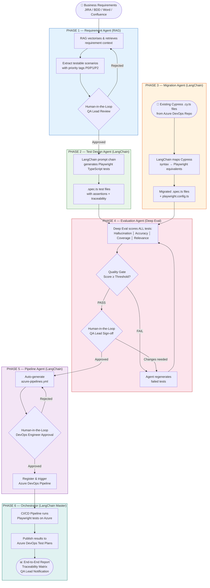
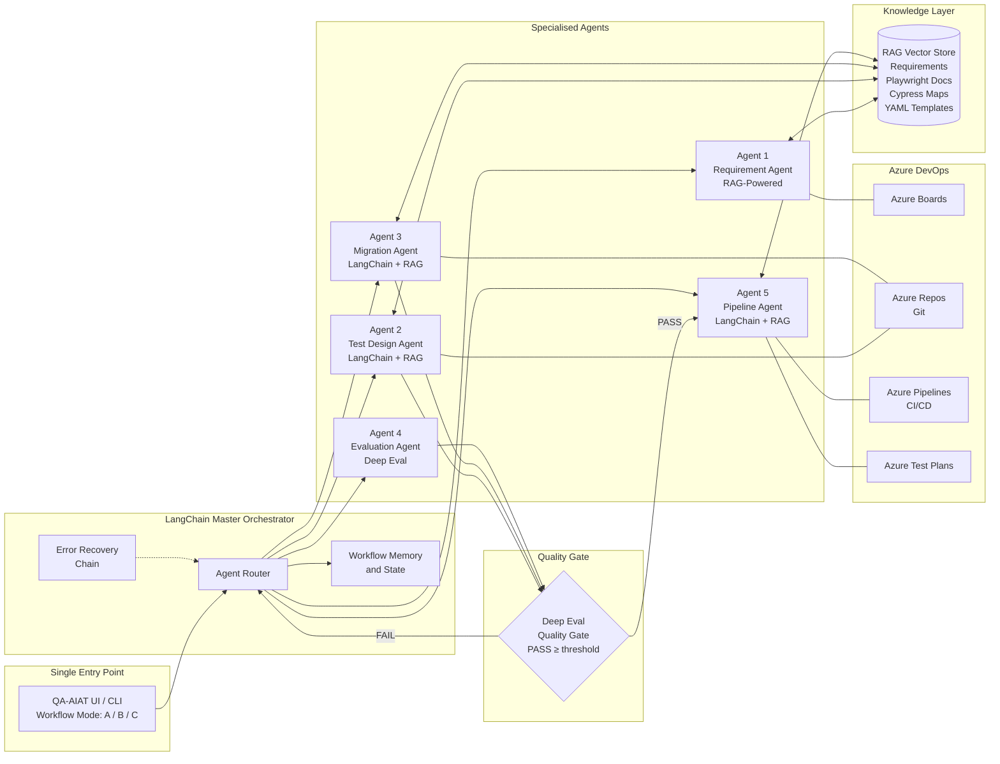
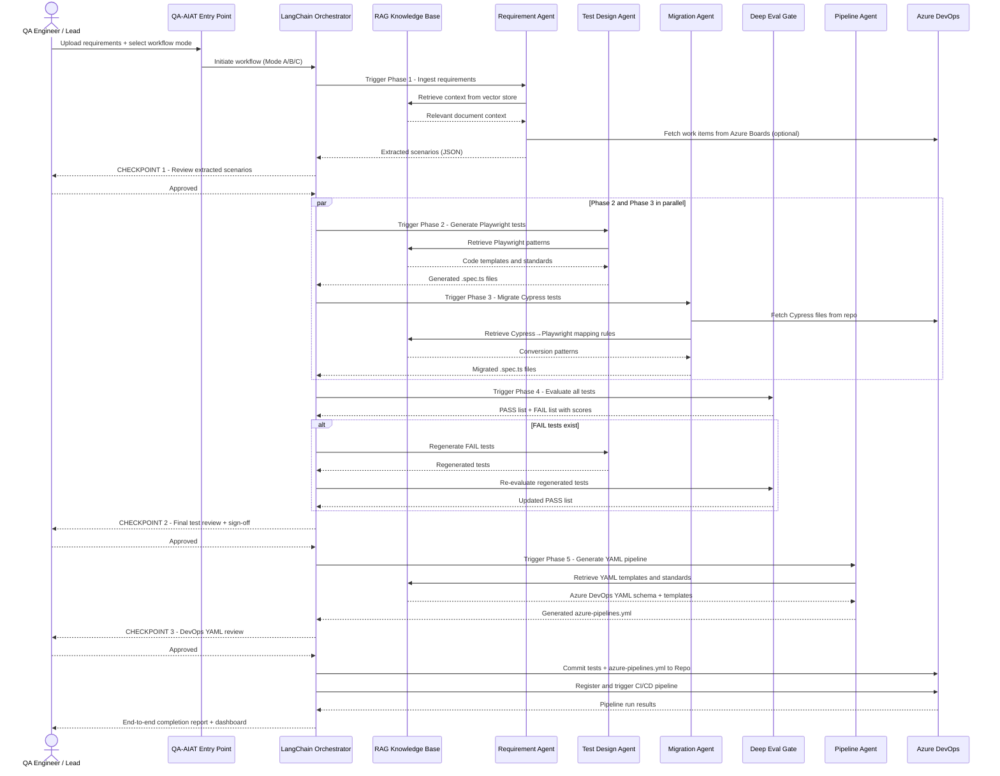
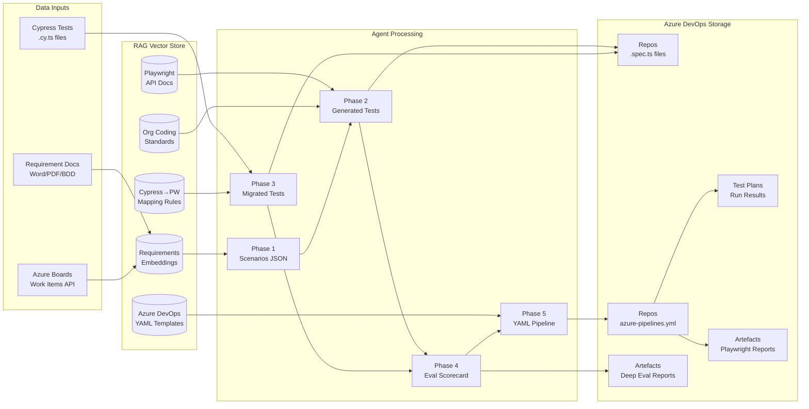

# QA-AIAT — AI Agentic Tool Architecture
## QA Automation Transformation: Cypress → Playwright via AI Agents
**Version:** 1.0 | **Date:** April 7, 2026  
**Framework:** LangChain + RAG + Deep Eval + Playwright + Azure DevOps

---

## Table of Contents
1. [Architecture Overview](#1-architecture-overview)
2. [Architectural Layers](#2-architectural-layers)
3. [End-to-End Flow Diagram](#3-end-to-end-flow-diagram)
4. [Agent Architecture Diagram](#4-agent-architecture-diagram)
5. [Component Interaction Diagram](#5-component-interaction-diagram)
6. [Phase-by-Phase Architecture Map](#6-phase-by-phase-architecture-map)
7. [Azure DevOps Integration Architecture](#7-azure-devops-integration-architecture)
8. [Technology Stack](#8-technology-stack)
9. [Data Flow & Storage](#9-data-flow--storage)
10. [Security & Governance Architecture](#10-security--governance-architecture)

---

## 1. Architecture Overview

**QA-AIAT** (QA AI Agentic Tool) is a LangChain-orchestrated, multi-agent system
that automates the complete QA lifecycle from business requirements to deployed
Playwright tests running in Azure DevOps CI/CD pipelines.

### Core Architectural Principles

| Principle | Description |
|---|---|
| **Agent Specialisation** | Each agent handles one domain; no agent has overlapping responsibilities |
| **RAG Grounding** | All AI outputs are grounded in project-specific knowledge, not generic LLM knowledge |
| **Quality Gate First** | No AI output commits to the repository without passing the Deep Eval quality gate |
| **Human-in-the-Loop** | Engineers retain control at every critical decision point |
| **Single Entry Point** | All agents unified under one LangChain orchestrator accessible via one interface |

---

## 2. Architectural Layers

```
╔══════════════════════════════════════════════════════════════════════════╗
║                        PRESENTATION LAYER                                ║
║              Single Entry Point UI / CLI / REST API                      ║
║         (Workflow Mode Selection: NEW | MIGRATE | FULL PIPELINE)         ║
╚══════════════════════════════════════════════════════════════════════════╝
                                    │
╔══════════════════════════════════════════════════════════════════════════╗
║                      ORCHESTRATION LAYER                                 ║
║                   LangChain Master Orchestrator                          ║
║          Agent Router │ Workflow State │ Memory │ Error Recovery         ║
╚══════════════════════════════════════════════════════════════════════════╝
         │              │              │              │              │
╔══════╗ ╔══════╗ ╔══════╗ ╔══════╗ ╔══════════════════════╗
║ Req  ║ ║ Test ║ ║Migrat║ ║ Eval ║ ║   Pipeline Agent     ║
║Agent ║ ║Design║ ║Agent ║ ║Agent ║ ║  (YAML + Azure CI)   ║
║Phase1║ ║Phase2║ ║Phase3║ ║Phase4║ ║       Phase 5        ║
╚══════╝ ╚══════╝ ╚══════╝ ╚══════╝ ╚══════════════════════╝
                                    │
╔══════════════════════════════════════════════════════════════════════════╗
║                       KNOWLEDGE LAYER                                    ║
║                    RAG — Vector Knowledge Base                           ║
║   Requirements │ Playwright Docs │ Cypress Maps │ YAML Templates         ║
╚══════════════════════════════════════════════════════════════════════════╝
                                    │
╔══════════════════════════════════════════════════════════════════════════╗
║                      EVALUATION LAYER                                    ║
║                  Deep Eval — Quality Gate Engine                         ║
║    Hallucination │ Assertion │ Coverage │ Relevance │ Equivalence         ║
╚══════════════════════════════════════════════════════════════════════════╝
                                    │
╔══════════════════════════════════════════════════════════════════════════╗
║                      INTEGRATION LAYER                                   ║
║                    Azure DevOps Platform                                 ║
║        Boards │ Repos (Git) │ Pipelines │ Test Plans │ Artefacts          ║
╚══════════════════════════════════════════════════════════════════════════╝
```

---

## 3. End-to-End Flow Diagram



---

## 4. Agent Architecture Diagram



---

## 5. Component Interaction Diagram



---

## 6. Phase-by-Phase Architecture Map

| Phase | Agent | AI Technology | Inputs | Outputs | Gate |
|---|---|---|---|---|---|
| **Phase 1** | Requirement Agent | RAG + LangChain | Requirements docs, Azure Boards | Testable scenarios JSON | Deep Eval hallucination check |
| **Phase 2** | Test Design Agent | LangChain + RAG | Scenarios JSON, Playwright patterns | `.spec.ts` test files | — |
| **Phase 3** | Migration Agent | LangChain + RAG | Cypress `.cy.ts` files | Migrated `.spec.ts` + `playwright.config.ts` | — |
| **Phase 4** | Evaluation Agent | Deep Eval | Phase 2 + Phase 3 tests, Phase 1 scenarios | PASS/FAIL scorecard + quality report | Deep Eval quality gate ≥ threshold |
| **Phase 5** | Pipeline Agent | LangChain + RAG | PASS tests metadata, Azure DevOps config | `azure-pipelines.yml` + pipeline run | Schema validation + DevOps approval |
| **Phase 6** | LangChain Orchestrator | LangChain (Master) | All phase outputs | Unified tool, end-to-end report, traceability matrix | QA Lead master sign-off |

---

## 7. Azure DevOps Integration Architecture

```
┌─────────────────────────────────────────────────────────────────┐
│                     AZURE DEVOPS PLATFORM                        │
│                                                                   │
│  ┌──────────────┐  ┌──────────────┐  ┌────────────────────────┐ │
│  │ Azure Boards │  │ Azure Repos  │  │   Azure Pipelines      │ │
│  │              │  │   (Git)      │  │                        │ │
│  │ Work Items   │  │ feature/ai-  │  │ azure-pipelines.yml    │ │
│  │ User Stories │  │ gen-tests    │  │ Trigger: push / PR /   │ │
│  │ Acceptance   │  │ migration/   │  │         schedule       │ │
│  │ Criteria     │  │ playwright   │  │                        │ │
│  │              │  │ .spec.ts     │  │ Stages:                │ │
│  │ READ by      │  │ playwright   │  │  1. npm install        │ │
│  │ Phase 1 RAG  │  │ .config.ts   │  │  2. playwright install │ │
│  │ Agent via    │  │              │  │  3. run tests          │ │
│  │ REST API     │  │ WRITTEN by   │  │     (Chromium/FF/WK)   │ │
│  │              │  │ Phase 2,3,5  │  │  4. publish results   │ │
│  └──────────────┘  └──────────────┘  │  5. upload artefacts  │ │
│                                       └────────────────────────┘ │
│  ┌──────────────┐  ┌──────────────────────────────────────────┐  │
│  │ Azure Test   │  │            Azure Artefacts               │  │
│  │   Plans      │  │                                          │  │
│  │              │  │  • Deep Eval evaluation report           │  │
│  │ Test results │  │  • Playwright HTML test report           │  │
│  │ published    │  │  • Migration summary report              │  │
│  │ after every  │  │  • End-to-end completion report          │  │
│  │ pipeline run │  │  • Traceability matrix JSON              │  │
│  └──────────────┘  └──────────────────────────────────────────┘  │
└─────────────────────────────────────────────────────────────────┘
         ▲ READ / WRITE        ▲ REGISTER        ▲ TRIGGER
         │                     │                  │
┌─────────────────────────────────────────────────────────────────┐
│                   QA-AIAT — LangChain Orchestrator               │
│               Phase 1 Agent │ Phase 5 Pipeline Agent            │
└─────────────────────────────────────────────────────────────────┘
```

---

## 8. Technology Stack

### AI & Orchestration

| Component | Technology | Role |
|---|---|---|
| **Orchestration** | LangChain | Agent chaining, routing, memory, workflow state |
| **LLM** | Azure OpenAI (GPT-4o) | Language generation for all agents |
| **RAG** | LangChain + FAISS / Azure AI Search | Vector store, document retrieval, context grounding |
| **Evaluation** | Deep Eval | Quality gate scoring, hallucination detection |
| **Embeddings** | Azure OpenAI text-embedding-ada-002 | Document vectorisation for RAG |

### Test Automation

| Component | Technology | Role |
|---|---|---|
| **Test Framework** | Playwright | Test execution, cross-browser support |
| **Language** | TypeScript | Strong typing for test scripts |
| **Config** | YAML (playwright.config.ts) | Test configuration and reporter setup |
| **Reporter** | Playwright HTML Reporter | Test result HTML reports |

### DevOps & Infrastructure

| Component | Technology | Role |
|---|---|---|
| **Source Control** | Azure DevOps Repos (Git) | Version control, branch strategy |
| **CI/CD** | Azure DevOps Pipelines (YAML) | Automated build, test, deploy |
| **Test Management** | Azure DevOps Test Plans | Test result tracking and history |
| **Artefacts** | Azure DevOps Artefacts | Report and evaluation output storage |
| **Work Tracking** | Azure DevOps Boards | Requirement source, traceability linking |

---

## 9. Data Flow & Storage



---

## 10. Security & Governance Architecture

### Security Controls

| Control | Implementation |
|---|---|
| **Secrets Management** | All API keys stored in Azure DevOps Pipeline Variables (encrypted); never hardcoded in YAML or code |
| **Service Principal** | Azure DevOps pipeline runs under a least-privilege service principal |
| **Branch Protection** | All AI-generated test commits require Pull Request + peer review before merge to main |
| **Audit Trail** | Every agent decision and output logged with timestamp and agent ID in Azure DevOps Artefacts |
| **Data Privacy** | Requirement documents processed in-tenant; no data sent to external LLM without approval |
| **Quality Gate** | Deep Eval hallucination check prevents LLM-fabricated test content from reaching production pipeline |

### Governance Model

```
Requirement Upload
      │
      ▼
[Phase 1] RAG extraction ──► Human Review ──► Approved? ──► Phase 2
                                                    │
                                                    No ──► Refine & Re-extract

[Phase 4] Deep Eval Gate ──► Quality Score ──► Pass? ──► Phase 5
                                                   │
                                                   No ──► Agent Retry (max 3x)
                                                          │
                                                          Still fail ──► QA Lead Escalation

[Phase 5] YAML Pipeline ──► DevOps Review ──► Approved? ──► Register & Trigger
                                                    │
                                                    No ──► Regenerate with feedback
```

---

## Architecture Decision Records (ADR)

### ADR-001: LangChain as Orchestration Framework
- **Decision:** Use LangChain for multi-agent orchestration
- **Rationale:** Native support for agent chaining, tool routing, memory management, and RAG integration; strong TypeScript/Python ecosystem alignment
- **Alternatives Considered:** AutoGen, CrewAI, custom orchestration
- **Status:** Accepted

### ADR-002: RAG for Requirement Grounding
- **Decision:** All requirement-related AI generation uses RAG
- **Rationale:** Prevents LLM hallucination on project-specific content; ensures all generated tests reflect YOUR requirements, not generic patterns
- **Status:** Accepted

### ADR-003: Deep Eval as Quality Gate
- **Decision:** Deep Eval is the mandatory quality gate before any test commit
- **Rationale:** Objective, measurable quality scoring; hallucination detection specific to test content evaluation; open-source with enterprise extensibility
- **Status:** Accepted

### ADR-004: Human-in-the-Loop at Every Critical Checkpoint
- **Decision:** Engineers retain approval control at Phase 1 exit, Phase 4 exit, and Phase 5 exit
- **Rationale:** Ensures AI outputs meet business standards; builds team confidence in AI-generated artefacts; satisfies enterprise governance requirements
- **Status:** Accepted

### ADR-005: Azure DevOps as Sole Repository and Pipeline Platform
- **Decision:** All source control, CI/CD, and test result storage on Azure DevOps
- **Rationale:** Existing organisational platform; eliminates multi-tool complexity; native integration with Azure OpenAI and test publishing
- **Status:** Accepted

---

*Architecture Document | QA-AIAT | Version 1.0 | April 7, 2026*
